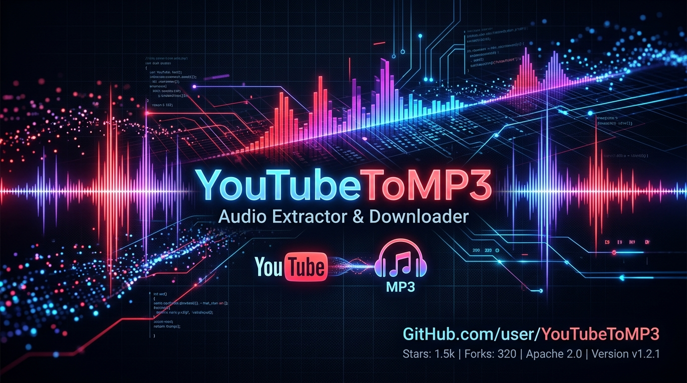
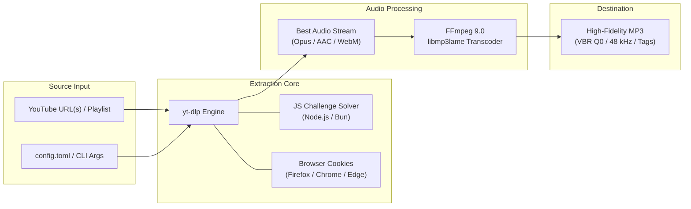

<div align="center">



# YouTubeToMP3

**Next-generation, high-fidelity YouTube video & playlist audio extractor powered by `yt-dlp`, `FFmpeg`, and `uv`.**

[](https://www.python.org/downloads/)
[](https://github.com/astral-sh/uv)
[](https://github.com/yt-dlp/yt-dlp)
[](https://ffmpeg.org/)
[](LICENSE)
[](#prerequisites)

<p align="center">
  <a href="#key-features">Key Features</a> •
  <a href="#quick-start">Quick Start</a> •
  <a href="#configuration">Configuration</a> •
  <a href="#cli-usage">CLI Usage</a> •
  <a href="#architecture">Architecture</a> •
  <a href="#troubleshooting">Troubleshooting</a> •
  <a href="#license">License</a>
</p>

</div>

---

## Overview

**YouTubeToMP3** is an ultra-fast, robust, and automated audio downloader designed to extract pristine MP3 tracks from single YouTube videos or entire playlists. 

Built on top of the battle-tested **`yt-dlp`** core and encoded using **`FFmpeg`**, it solves modern YouTube challenges including bot-detection barriers and JavaScript signature/n-challenge puzzles out of the box. Fully managed with **`uv`**, you get instant setup, zero dependency drift, and native support for modern Python (3.14+).

---

## Key Features

- ⚡ **Modern `uv` Project Management** — No legacy `pip` or fragile `requirements.txt`. Deterministic resolution with `uv.lock` in milliseconds.
- 🐍 **Python 3.14+ Native** — Built and verified on Python 3.14 for maximum performance and future-proof compatibility.
- 🛡️ **Anti-Bot & Challenge Bypass** — Transparent browser session cookie extraction (`Firefox`, `Chrome`, `Edge`, etc.) and integrated JavaScript challenge execution (`Node.js`, `Bun`, `Deno`).
- 🎵 **Lossless Transcoding** — Extracts raw best-audio streams and encodes to variable-bitrate (VBR Q0 ~245-320 kbps) or constant-bitrate MP3 via `libmp3lame`.
- 📋 **Batch & Playlist Downloading** — Fetch full album playlists or multiple video URLs with automated naming and metadata tagging.
- 🔍 **Intelligent FFmpeg Discovery** — Auto-detects custom paths (e.g. `C:\ffmpeg\dist\bin`), system `PATH`, local `./ffmpeg` binaries, or downloads essentials on Windows automatically.
- 🎨 **Rich Terminal Interface** — Live color-coded progress notifications, structured banners, and error diagnostic hints powered by `rich`.
- 💻 **Flexible Dual Mode** — Run declaratively via `config.toml` or interactively with full CLI flag overrides.

---

## Quick Start

### 1. Prerequisites

Ensure you have the following installed on your system:

| Dependency | Required? | Description |
| :--- | :---: | :--- |
| **Python 3.14+** | **Yes** | Managed automatically or via system |
| **`uv`** | **Yes** | Blazing-fast Python package installer & resolver ([Install Guide](https://docs.astral.sh/uv/getting-started/installation/)) |
| **FFmpeg** | **Yes** | Audio conversion engine (Auto-detected if in `PATH` or `C:\ffmpeg\dist\bin`) |
| **Node.js / Bun / Deno** | Optional | JavaScript runtime for solving YouTube player challenges |

### 2. Clone & Setup

```bash
# 1. Clone repository
git clone https://github.com/laurentvv/YouTubeToMP3.git
cd YouTubeToMP3

# 2. Sync dependencies using uv (creates isolated .venv in seconds)
uv sync

# 3. Create your configuration from template
cp config.example.toml config.toml
```

---

## Configuration

Settings are centrally managed in `config.toml`:

```toml
[ffmpeg]
# Path to directory containing ffmpeg executable (or "auto" / empty for auto-detection)
directory = "C:\\ffmpeg\\dist\\bin"
executable = "ffmpeg.exe"

[youtube]
# List of YouTube video URLs to download and convert
video_urls = [
    "https://youtu.be/_R5r-2YJNyc?si=CKE7c_vE1omzZOcX"
]
# Browser from which to import session cookies (bypasses YouTube "Sign in to confirm you're not a bot")
# Options: "firefox", "chrome", "edge", "brave", "opera", or "" to disable
cookies_from_browser = "firefox"

[youtube-playlist]
# URL of a full playlist to download (leave blank if downloading standalone videos)
playlist_url = ""

[output]
# Directory where MP3 files will be stored (relative or absolute)
directory = "mp3"
# MP3 audio quality: "0" (best VBR ~245-320 kbps) down to "9" (lowest quality)
audio_quality = "0"
```

---

## CLI Usage

### Option A: Run via `config.toml`

Run the script directly using `uv` with all settings read from `config.toml`:

```bash
uv run main.py
```

### Option B: Direct URL Input (Interactive CLI)

Pass one or more URLs directly on the command line:

```bash
# Download a single video
uv run main.py "https://youtu.be/_R5r-2YJNyc"

# Download multiple videos & specify destination folder
uv run main.py -o "C:\Music\Rock" "https://youtu.be/video1" "https://youtu.be/video2"

# Specify custom browser for cookies on the fly
uv run main.py -b firefox "https://www.youtube.com/watch?v=dQw4w9WgXcQ"
```

### CLI Options Reference

```text
usage: main.py [-h] [-c CONFIG] [-o OUTPUT] [-b BROWSER] [-q QUALITY] [--ffmpeg FFMPEG] [urls ...]

YouTubeToMP3 - High Quality Audio Downloader & Converter

positional arguments:
  urls                  YouTube video or playlist URLs to download

options:
  -h, --help            Show this help message and exit
  -c, --config CONFIG   Path to custom config file (default: config.toml)
  -o, --output OUTPUT   Output directory for MP3 files
  -b, --browser BROWSER Browser to import cookies from (e.g. firefox, chrome, edge)
  -q, --quality QUALITY MP3 audio quality (0 = best VBR, 9 = lowest)
  --ffmpeg FFMPEG       Custom path to FFmpeg directory or binary
```

---

## Architecture



---

## Troubleshooting

<details>
<summary><b>1. "Sign in to confirm you're not a bot"</b></summary>
<br>

YouTube aggressively rate-limits or blocks unauthenticated requests from data-center or automated IP ranges.
- Ensure `cookies_from_browser = "firefox"` (or your preferred browser where you are logged into YouTube) is configured in `config.toml`.
- Alternatively, supply the browser flag via CLI: `uv run main.py -b firefox "<url>"`.
</details>

<details>
<summary><b>2. "JavaScript challenge solving failed"</b></summary>
<br>

YouTube uses encrypted signatures (`n`-challenges) that require a JavaScript interpreter.
- Install [Node.js](https://nodejs.org/) (`node`), [Bun](https://bun.sh/), or [Deno](https://deno.com/).
- YouTubeToMP3 automatically detects `node`, `bun`, and `deno` from your system path.
</details>

<details>
<summary><b>3. "FFmpeg not found"</b></summary>
<br>

- Set `directory = "C:\\ffmpeg\\dist\\bin"` (or your custom FFmpeg path) in `config.toml`.
- Or add FFmpeg to your system environment `PATH`.
- On Windows, if no FFmpeg is present, the script can automatically download and configure portable FFmpeg essentials.
</details>

---

## Contributing

Contributions are welcome! If you'd like to improve YouTubeToMP3:

1. Fork the repository
2. Create your feature branch (`git checkout -b feature/amazing-feature`)
3. Commit your changes (`git commit -m 'Add amazing feature'`)
4. Push to the branch (`git push origin feature/amazing-feature`)
5. Open a Pull Request

---

## License

This project is licensed under the **MIT License** — see the [LICENSE](LICENSE) file for details.

---

<div align="center">
  <sub>Built with care by <a href="https://github.com/laurentvv">laurentvv</a>. Powered by <b>yt-dlp</b>, <b>FFmpeg</b>, and <b>uv</b>.</sub>
</div>
